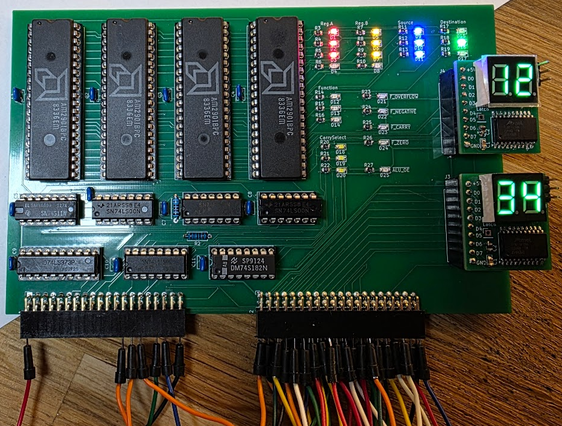

# Experiments with a am29xx based CPU

The am29xx series of bitslice CPU parts were a big thing when they arrived, and they have been used in many vintage designs. I find them interesting because they are still reasonably simple to understand, and they do replace a large amount of TTL logic for a homebrew CPU. I got a few of these parts from different places and decided to play with them to get an idea on how they work.

To do that the plan is to build some parts for a real CPU. It is not intended to be finished, it is intended to teach me and help me understand these parts, and to help me understand what is important in a CPU design using them.

## Process

NONE OF THIS IS READY FOR ANYTHING!! DO NOT ORDER BOARDS, they will not work ;)

### The ALU, getting to know the am2901

I am starting with the ALU part as I got 4 am2901's in my parts bin ;) I want to make a 16 bit ALU out of them, and the 2901's would also contain the generic register set (r0..r15).
I did consider breadboarding that, but 16 bits is a lot of wires, reliable breadboards are pretty expensive, and I really, *really* did not feel like wiring that all up...
So instead I created a Kicad schematic hoping that I would not be too far off, and I created a PCB using the Autorouter to route most traces so that I would not waste time on that. It is a 2 layer board so making fixes for the mistakes I've undoubtedly made should not be too difficult.

The board has 4x am2901, some glue logic to detect condition codes, a lot of leds to show ALU function inputs, and two sockets for my [8 bit bus to hex display](https://github.com/fjalvingh/8bit-busdisplay) so that we can easily follow what is happening.

The board uses two 40 pin double row pin headers (female) as a connector to a later possible backplane, as these are cheap and relatively reliable. And they make it easy to exercise the board using an Arduino Mega 2560.

A picture of the completed board:

The wires into the connectors are breadboard patch wires, and they prove to be useless, so the next try is to make real pin header wires to the Arduino.

## Progress

* 2025/11/23 Created this Github repo
* 2025/10/18 Started the ALU Kicad design

## Documentation used

I am using the following documents to make sense of everything.

### AM29xx series:
 
* [The AM2900 family data book](documentation/1978_The_Am2900_Family_Data_Book.pdf)
* [The am2901 datasheet](documentation/AM2901-AdvancedMicroDevices.pdf)
* [The am2910 datasheet](documentation/am2910.pdf)
* [Bit Slice microprocessor design](http://www.bitsavers.org/components/amd/bitslice/Mick_Bit-Slice_Microprocessor_Design_1980.pdf) by John Mick and Jim Brick
* [am2910 application note: programming the 2910](documentation/Am2910_apnote_Programming%20the.pdf)
* A more readable [am2901 block diagram](documentation/am2901-blockdiagram.jpg)
* Bit slice design - controllers and ALUs by [Donnamaie White](https://www.donnamaie.com/) - whose site has a lot of other interesting information.
* The "Build a microcomputer" series of appnotes, also [on the site of Donnamaie White, here](https://www.donnamaie.com/AMD_2900.html).
* [A microprogrammed computer](documentation/16-bit%20computer%20book.pdf), also from Donnamaie's site.

